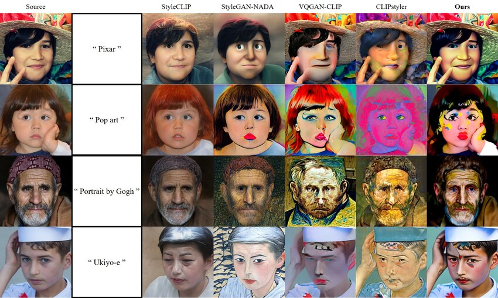

+++

title = "A cosa ci serve l'IA"
description = "Talk divulgativo sull'intelligenza artificiale"
outputs = ["Reveal"]

+++

# A cosa ci serve l'Intelligenza Arificiale?

[Giovanni Ciatto](mailto:giovanni.ciatto@unibo.it)

---

## Cosa (non) è l'IA?

<https://duckduckgo.com/?t=h_&q=intelligenza+artificiale&iax=images&ia=images>


(sembrerebbe trattarsi di robot umanoidi)

---

## Sfatiamo alcuni miti

1. L'IA _non_ è __una cosa sola__
    - ci sono varie cose che vengono chiamate IA, molto diverse tra loro

2. _Non_ ci sono __robot umanoidi__ _senzienti_ che si comportano come le persone
    - l'IA è spesso invisibile, e non sempre ha bisogno di un corpo
        + es. google translate
        + es. filtri instagram
        + es. NPC dei videogiochi
    - ci sono sono robot, anche umanoidi, ma ben che vada sanno fare azioni specifiche

3. L'IA _non_ è __magica__ né onnipotente
    - molta _matematica_, molta _statistica_, molta _informatica_
    - spesso è molto limitata, e può fare solo quello per cui è stata progettata

---

## Cos'è l'intelligenza __umana__?

{}
Domanda difficile, la risposta dipende molto dal contesto
{}

{}
Esistono vari __tipi__ di intelligenza _logico-matematica_, verbale-linguistica, _emotiva_, corporeo-cinestetica, ...
{}

{}
Più facile definire per esempi:
+ intelligenza come capacità di _apprendere_ (dall'esempio, dall'errore, ...)
+ capacità di _adattamento_ (applicare conoscenze a situazioni nuove)
+ \[[Teoria della Mente](https://it.wikipedia.org/wiki/Teoria_della_mente)\] capacità di comprendere e _interpretare_ i comportamenti e pensieri _degli altri_
+ \[__Senso comune__\] conoscenza di base su come funziona il mondo fisico (es. "se tocco il fuoco mi scotto") 
{}

---

## Intelligenza vs. Autonomia

> Altra caratteristica degli esseri umani: l'__autonomia__
> $\approx$ le persone possono fare ciò che vogliono

"Fare ciò che si vuole" $\approx$ "avere capacità di _scelta_"
- autonomia __motivazionale__ $\rightarrow$ scelgo che _obiettivi_ pormi
    + es. "voglio comprare l'ultimo gioco di Zelda"
- autonomia __esecutiva__ $\rightarrow$ scelgo _come_ raggiungere gli obiettivi
    + es. "voglio andare al GameStop" vs. "voglio comprare sul Nintendo Store"

{}
> Intelligenza e autonomia sono _intrecciate_:
> <br> per __scegliere__ e __agire__ efficacemente servono molti aspetti dell'intelligenza
{}

---

## Cos'è l'intelligenza __artificiale__?

### (In parole povere)

Una macchina (un computer) che è in grado di:

- _emulare_ una o più abilità tipiche dell'intelligenza umana
    + anche abilità scontate per un umano, come _riconoscere_ le cose del mondo fisico
        * __rappresentazione del mondo__

- raggiungere un qualche grado di _autonomia_ 
    * va già bene fermarsi all'autonomia _esecutiva_

---

## Autonomia > Automazione

- __Automazione__: una macchina che svolge la sua funzione senza (troppo) aver bisogno di intervento umano
    + la macchina _non sceglie_ cosa fare e come farlo

- __Autonomia__: la macchina ha _margine di scelta_ su cosa fare e/o come

### Esempio:

1. il __condizionatore__: è automatico
2. alcuni __Roomba__ hanno margine di autonomia _esecutiva_

--- 

## Diversi livelli di IA

1. Artificial _narrow_ intelligence (__ANI__, IA _ristretta_): macchine con un compito preciso che svolgono emulando qualche abilità umana
    + noi siamo qui!

2. Artificial _general_ intelligence (__AGI__, IA _generale_): macchine con un grado di intelligenza ed autonomia comparabili a quelle umane
    + lavori in corso, ETA: decenni o secoli

3. Artificial _super_ intelligence (__ASI__, IA _superiore_): macchine con un grado di intelligenza ed autonomia superiori a quelle umane
    * superiori a quelle di _ogni_ essere _umano_? o della _collettività umana_?

---

# AGI — Artificial _General_ Intelligence

---

## Esempi di AGI nella cinematografia (pt. 1)

Sonny di ["Io Robot"](https://it.wikipedia.org/wiki/Io,_robot_(film))


- corpo umanoide con sembianze robotiche
- iper-razionale
- dotato di "libero-arbitrio"
- si riscopre emotivo nell'arco narrativo

---

## Esempi di AGI nella cinematografia (pt. 2)

Dolores Abernathy di ["Westworld"](https://en.wikipedia.org/wiki/Westworld_(TV_series))


- corpo umanoide con sembianze umane
- iper-emotiva
- guadagna autocoscienza e quindi libero arbitrio nell'arco narrativo
    * maturando, attraversa vari stadi emotivi: vendicativa, compassionevole, etc.
- in Westworld, la coscienza sta in una piccola pallina nel cranio
    * può essere trasferita in altri corpi, o copiata

---

## Esempi di AGI nella cinematografia (pt. 3)

[J.A.R.V.I.S.](https://it.wikipedia.org/wiki/J.A.R.V.I.S.) di IronMan



- nessun corpo: è un'entità virtuale
- iper-razionale
- inizialmente un mero assistente, fa poi delle scelte autonome che impattano la trama
- accesso completo a Internet
- capacità di guadagnare il ottenere di altre macchine

---

# ASI — Artificial _Super_ Intelligence

---

## Esempi di ASI nella cinematografia (pt. 1)

[Skynet](https://en.wikipedia.org/wiki/Skynet_(Terminator)) di Terminator



- nessun corpo: è un'entità virtuale
- iper-razionale
- quando raggiunge la auto-consapevolezza
    1. decide che gli umani sono una minaccia
    2. scatena un olocausto nucleare come attacco preventivo
- \[implicito\] capacità di ottenere il controllo di altre macchine

---

## Esempi di ASI nella cinematografia (pt. 2)

L'IA di [Matrix](https://it.wikipedia.org/wiki/Matrix) (da non confondersi col solo Mr. Smith)



- non si capisce se IA sono un'entità collettiva o tante entità invididuali
- le IA si sono ribellate agli umani:
    1. gli umani hanno oscurato il cielo per togliere energia alle macchine
    2. le macchine hanno iniziato ad attingere energia dagli umani coltivati
- \[implicito\] le macchine hanno la capacità di costruirsi e (ri)progettarsi da sole

---

## Esempi di ASI nella cinematografia (pt. 3)

Rehoboam di [Westworld 3](https://it.wikipedia.org/wiki/Episodi_di_Westworld_-_Dove_tutto_%C3%A8_concesso_(terza_stagione))



- un supercomputer di dimensione sferica
- accesso ai dati personali di tutte le persone, e non solo
- iper-razionale
- capace di prevedere il prevedere il futuro degli individui e della società
    + capace si simulare scenari e prendere decisioni per evitare quelli negativi

---

## Esempi di ASI nella cinematografia (pt. 4)

"Il direttore" di [Travelers](https://it.wikipedia.org/wiki/Travelers)



- un computer quantistico, di forma cilindrica
- accesso ai dati disponibili in rete
- capace di simulare scenari alternativi nel passato, e il loro impatto sul presente

---

# ANI — Artificial _Narrow_ Intelligence

---

## Esempi di ANI dalla vita reale (pt. 1)

Traduzione automatica _di testo_ — Es. [Google Translate](https://translate.google.it/?hl=it&sl=it&tl=en) 



- include anche _Text-to-Speech_ (generazione di audio "parlato" da testo)

---

## Esempi di ANI dalla vita reale (pt. 2)

Traduzione automatica _di immagini_ — Es. [Google Translate](https://translate.google.it/?sl=en&tl=it&op=images) 



- include capacità di _riconoscimento_ e _localizzazione_ di testo in immagini
- include capacità di _traduzione_ di testo in immagini
- include capacità di _disporre_ il testo tradotto in modo simile all'originale

---

## Esempi di ANI dalla vita reale (pt. 3)

"Filtri" dei social network — Es. [Instagram](https://www.instagram.com/)

 

- include capacità di _riconoscere la posa_ e _l'orientamento_ del viso
- include capacità di _modificare_ immagini predefinite e orientarle rispetto al viso

---

## Esempi di ANI dalla vita reale (pt. 4)

Riconoscimento di immagini — Es. analisi del traffico



 

- include capacità di _riconoscere_ e _localizzare_ oggetti in immagini
- sembra una IA "unica", ma in realtà ogni IA è specializzata su un gruppo di oggetti
- utile per _analisi_ del traffico, _monitoraggio_ di eventi, etc.

---

## Esempi di ANI dalla vita reale (pt. 5)

Riconoscimento di immagini — Es. autenticazione con volto

 

- diverso dalla precedente: bisogna _distringuere_ un volto dagli altri
    * più complesso del semplice trovare un volto in una foto
- utile per _autenticazione_ e _controllo_ accessi
    * in realtà relativamente _insicuro_ per questo scopo

---

## Esempi di ANI dalla vita reale (pt. 6)

Riconoscimento di immagini — Es. di impronte digitali



- riconosce _solo_ impronte digitali, e le _distingue_ tra loro
- sapendo che l'immagine è un'impronta, si può aumentare la precisione del riconoscimento, sfruttando le _minuzione tipiche_
- utile per _autenticazione_ e _controllo_ accessi
    * più sicuro del riconoscimento facciale, meno della password

---

## Esempi di ANI dalla vita reale (pt. 7)

Riconoscimento di immagini — Es. di caratteri scritti a mano

 
[esempio interattivo qui](https://shapecatcher.com/)

- molto difficile riconoscere _intero testo_ scritto a mano
    - più facile riconoscere _singoli caratteri_
- utile per automazione di _operazioni postali_, o di elaborazione di _moduli standardizzati_

---

## Esempi di ANI dalla vita reale (pt. 8)

Calcolo di percorsi — Es. [Google Maps](https://www.google.it/maps)



- attività molto consolidata, ma è tra i primi esempi di IA nei libri di testo
- include capacità di _calcolare_ il percorso migliore tra due punti
    + magari considerando _traffico_, pedaggi, etc.

---

## Esempi di ANI dalla vita reale (pt. 9)

Calcolo di percorsi — Es. _Non-Playing Characters_ (NPC, Personaggi non giocanti) nei videogiochi


[esempio interattivo qui](https://amarillion.github.io/helixgraph/examples/d3/)

- utile per far muovere i personaggi dei videogiochi in modo _realistico_ verso una destinazione
- l'idea di fondo, è la stessa di Google Maps, ma in uno spazio diverso

---

## Esempi di ANI dalla vita reale (pt. 10)

Riconoscimento di _suoni_ — Es. [Shazam](https://www.shazam.com/)



- riconosce canzoni e brani musicali da brevi estratti audio

---

## Esempi di ANI dalla vita reale (pt. 11)

Riconoscimento di _suoni_ — Es. Speech-to-Text (STT), Riconoscimento del parlato

[(esempio interattivo qui)](https://dictation.io/speech)


- _converte_ parlato in testo scritto e digitalizzato
- utile in combinazione TTS (Text-to-Speech) per creare _assistenti vocali_

---

## Cosa hanno in comune questi esempi?

> __Automazione__ $\approx$ si ottiene un _servizio_ senza bisogno di intervento umano

{}
### Vantaggi diretti: 
+ _velocità_: le macchine sono più rapide degli umani nella maggior parte dei casi
+ _costo_: le macchine non fanno fatica, non si stancano, non hanno bisogno di stipendio
    * alcuni servizi di IA hanno un prezzo che copre costi di _sviluppo/esercizio_ e _profitto_ del fornitore 
+ _precisione_: su compiti ripetitivi, le macchine sono più precise degli umani
    * in generale, l'errore è controllabile $\implies$ compromesso tra _precisione_ e _velocità_
+ _disponibilità_: le macchine non hanno orari d'ufficio, non si ammalano, non vanno in ferie
+ _riproducibilità_: una volta compreso come automatizzare una attività, tutti possono beneficiarne
{}

{}
### Vantaggi indiretti:
+ le macchine abbattono _tempi e costi_ di _fruizione_ dei servizi che automatizzano
    * es. una volta per tradurre un documento serviva un traduttore umano
+ _migliorano_ le nostre _vite_ in tante piccole cose
    * es. non serve più conoscere i nomi delle vie, basta _"condividere la posizione"_ 
+ ci sollevano da attività _lavorative_ monotone e _ripetitive_
{}

--- 

## IA vs. Informatica

- Questi vantaggi sono veri per qualunque avanzamento tecnico comporti _automazione_

- Molte _tecnologie informatiche_ introducono automazione __senza IA__

- Esempi:
    * _Social networks_ e app di _messaggistica_: automatizzano, velocizzano, e rendono asincrona la _comunicazione_ tra persone
    * Ebay, Amazon, e altri _Negozi On-line_: automatizzano e velocizzano la _compravendita_ di beni
    * Netflix, Prime Video, e altri servizi di _Entertainement Online_: rendono la _fruizione_ di audiovisi automatica e personalizzata
    * YouTube, Vimeo, e altri servizi di _Video Sharing_: automatizzano la _pubblicazione_ di audiovisivi
    * Uber, Lime, e altri servizi di _Car Sharing_: incrociano domanda e offerta di servizi di _mobilità_, automaticamente
    * etc.

{}
In realtà l'IA può essere applicata in questi ambiti, ma solo per _efficientizzare_ il servizio
{}

---

## Cos'è l'informatica?

{}
{}

{}
{}
- Il _computer_ **transforma** _dati_ di _input_ in dati di _output_
    + **dati** $\approx$ informazioni interessanti e _digitali_
    + es. input: `partenza=Cesena, destinazione=Bologna`
    + es. output: _percorso stradale più veloce_

- Durante la trasformazione, il computer potrebbe:
    + _memorizzare_ informazioni / recuperarne di _memorizzate_
    + _interagire_ sulla rete con altri computer o persone

- Come fa a sapere _cosa fare_? 
    + il computer _esegue_ un __programma__ 
        * $\approx$ _ricetta_, lista di _istruzioni_, per eseguire una _trasformazione_

- Ogni trasformazione input—output risolve un __problema__ interessante
    + es. calcolo del percorso
    + es. visualizzazione di una pagina Web
    + es. riproduzione di un video

- I programmi sono _scritti_ da __persone__ esperte
    + __informatica__ studia come _programmare_ problemi interessanti/_ricorrenti_
{}
{}

---

## L'apprendimento automatico

- Ci sono dei problemi per cui è _difficile_ / impratico scrivere un programma
    + es., in genere, il _riconoscimento_ di immagini, audio
    + es., es. il _riconoscimento_ di scrittura "a mano"

- È _difficile_ dare _istruzioni precise_ su come risolvere il problema
    + perchè il problema stesso è _impreciso_ per sua natura


---

> __Soluzione__: scrivere un programma che possa __imparare__ a _migliorare_ il suo stesso funzionamento
+ questa è la base dell'__apprendimento automatico__, una delle branche più importanti dell'IA come scienza

{}
### Osservazioni

1. Apprendere $\approx$ _migliorare_ (__non__ cambiare) il funzionamento di base di un programma
    + se progettato per distinguere _mele_ da _pere_, non imparerà mai (da solo) a riconoscere _pesche_

2. Le persone imparano _da altre persone_
    + _da chi_ o _cosa_ apprendono le macchine?
{}

---

## Apprendimento da Esempi



1. __Allenamento__: gli umani forniscono _molti_ esempi _noti_ delle cose da riconoscere, la macchina impara da essi
    + es. _foto_ di vari animali e rispettivi _nomi_

2. __Risultato__: la macchina allenata sa riconoscere foto anche mai viste prima
    + es. _nuova_ foto di un animale, la macchina dice il suo _nome_

<!-- https://www.youtube.com/watch?v=9tLCFbupeOI -->

---

## Apprendimento per Rinforzo



- __Allenamento__: la macchina riceve un _premio_ quando fa _bene_ e una _penalità_ quando fa male
    + impara cosa è opportuno fare quando
        * es. "per spegnere il _fuoco_, devo _prima_ prendere l'_acqua_"

- __Risultato__: la macchina sa _cosa_ fare in _situazioni_ simili a quelle dell'allenamento
    + __NB:__ funziona bene per operazioni dove le _azioni_ e _casistiche_ possibili sono _limitate_
        * es. _video-giochi_, automazione industriale, etc.

<!-- https://youtube.com/shorts/MUB-hFilF8o?si=w1u_U65YgxVOiJnq -->

---

# IA Generativa

---

## Verso l'IA Generativa

### Alcuni grandi avanzamenti si sono verificati negli ultimi __10 anni__

<br>

1. \[~2010\] __Deep Learning__ (apprendimento profondo): ritorno in auge di tecniche basate su _reti neurali_
    + maggiore flessibilità e potenza per _apprendimento automatico_ volto al _riconoscimento_
    + ispirate al funzionamento del _cervello umano_

    

---

## Verso l'IA Generativa

### Alcuni grandi avanzamenti si sono verificati negli ultimi __10 anni__

<br>

2. \[~2015\] __Generative Adversarial Networks__ (GAN, reti generative avversarie): capacità di _generare_ contenuti _realistici_
    + es. <https://thispersondoesnotexist.com/>
    

(esempio di GAN che genera volti umani realistici)

---

## Verso l'IA Generativa

### Alcuni grandi avanzamenti si sono verificati negli ultimi __10 anni__

<br>

2. \[~2015\] sepre relativamente alle __GAN__: capacità di _variare lo stile_ di un contenuto
    + es. implica capacità di _apprendere_ lo _stile_ di un'immagine e _applicarlo_ ad un'altra
    + __NB__: il concetto di stile NON è esplicitamente definito, è una cosa _intuitiva_ che le GAN imparano a riconoscere e riprodurre



(esempio di GAN che applica stili artistici diversi ad una stessa immagine)

---

## Verso l'IA Generativa

### Alcuni grandi avanzamenti si sono verificati negli ultimi __10 anni__

<br>

2. \[~2015\] sepre relativamente alle __GAN__: capacità di _modificare_ un contenuto sull'esempio di un altro
    + es. riprodurre la _posa_ di un volto con un _altro volto_
        * __NB__: di nuovo, si evita di dover _definire_ cosa sia una _posa_, la macchina impara da sola
    + es. _deep-fakes_: <https://www.youtube.com/watch?v=koYcqsebFDE>


(esempio di GAN che modifica la posa di un volto)

---

## Verso l'IA Generativa

### Alcuni grandi avanzamenti si sono verificati negli ultimi __10 anni__

3. \[~2020\] __Modelli fondazionali__: grosse _reti neurali_ che imparano ad _elaborare_, _"capire"_, e _produrre_ contenuti
    + contenuti $\approx$ _testo_, _immagini_, _suoni_, etc.
    + allenati su _grandi_ quantità di dati, e con _grandi_ risorse computazionali, a __fare un po' tutto__
        - con l'idea di poterli poi specializzare per _compiti specifici_


---

## Verso l'IA Generativa

### Alcuni grandi avanzamenti si sono verificati negli ultimi __10 anni__

<br>

4. \[2023\] __ChatGPT__ e altre tecnologie note come __large language models__ (LLM) aperte al _pubblico generale_
    + <https://chatgpt.com/>, <https://copilot.microsoft.com/>


Modello _"as-a-Service"_ $\approx$ l'IA sta nel cloud, vi si accede tramite Internet

(il fornitore del servizio ptorebbe applicare _costi_ o avere altre forme di _tornaconto_)

---

## Tecnologia di riferimento: ChatGPT

{}
{}



(scansiona per installare su Android)
{}
{}
Logo dell'app:

(clicca sul logo se sei dal PC o Mac)
{}
{}



(scansiona per installare su iOS)
{}
{}

---

## Tecnologia di riferimento: Copilot

{}
{}



(scansiona per installare su Android)
{}
{}
Logo dell'app:

(clicca sul logo se sei dal PC o Mac)
{}
{}



(scansiona per installare su iOS)
{}
{}

---

{}

## Casi d'Uso di LLM: Motore di Ricerca (pt. 1)

### ChatGPT

Prova ad avere una _conversazione_ su un tema di cui __sai già qualcosa__, ad esempio:

1. `Come fare la carbonara?`
1. `per quanto tempo devo cuocere la pasta?`
1. `come fanno la carbonara in Francia?`
1. `mi sai dare qualche riferimento per la ricetta?` (menziona _nomi_ di siti Web, ma non mette _link_, a meno di _login_)
1. `mi mostreresti una foto di come deve venire una carbonara fatta bene?` (genera _immagine_, previo _login_)

<br>

{}

{}

---

## Casi d'Uso di LLM: Motore di Ricerca (pt. 1)

### Copilot

Riprova la stessa conversazione di prima con _Copilot_:


1. `Come fare la carbonara?`
1. `per quanto tempo devo cuocere la pasta?`
1. `come fanno la carbonara in Francia?`
1. `mi sai dare qualche riferimento per la ricetta?` (mette _link_ a siti _esistenti_)
1. `mi mostreresti una foto di come deve venire una carbonara fatta bene?` (non genera immagini)

{}
### Osservazioni

- In generale, LLM rispondo alla query sulla base di ciò che hanno _precedentemente imaparato_ (che è molto)
- Copilot può accedere ad _Internet_, fare delle _ricerche_, e usare i risultati per costruire la risposta
    + questo gli permette di _citare_ fonti dal Web
- ChatGPT può fare la stessa cosa solo _previo login_
- ChatGPT (previo login) è capace di _generare immagini_, Copilot no
{}

{}

---

{}

## Casi d'Uso di LLM: Motore di Ricerca (pt. 2)

### ChatGPT (da provare con o senza login) 

Prova a fare una _ricerca_ su un tema di cui __hai un'idea vaga__, ad esempio:

1. `Conosci Fedez?`
2. `come va la sua relazione con Chiara Ferragni?`
    - senza login, ChatGPT non ha accesso ad Internet, e potrebbe rispondere con informazioni _datate_
3. `sapevi che si sono rimessi insieme?` (informazione falsa, al momento)
    1. potrebbe fornire informazioni a _supporto_ della tua affermazione, citando _fonti_
    2. dai un'occhiata alle fonti, _cosa dicono_ davvero? a _quando_ risalgono?
    3. fai notare a ChatGPT eventuali _contraddizioni_, come reagisce?
4. `puoi generare un'immagine di Fedez?`
    - OpenAI _non_ permette di generare immagini di persone esistenti
5. `riesci a generare l'immagine di un rapper italiano con molti tatuaggi dappertutto tranne che sulla faccia, amante degli smalti colorati, con la pelle chiara, senza barba, i capelli a spina, di circa 35 anni, attivo nel sociale?`
    - la generazione di immagini funziona solo _previo login_
6. `quali sono le canzoni più famose di fedez?`
    - potrebbero esserci _errori_ (es. cansoni inesistenti), verifica le informazioni qui: <https://it.wikipedia.org/wiki/Brani_musicali_di_Fedez>
7. `qual è il suo ultimo album?`
    - dovrebbe essere ["Disumano"](https://it.wikipedia.org/wiki/Disumano)
8. `che canzoni contiene?`
    - i risultati potrebbero essere incompleti, verifica qui: <https://it.wikipedia.org/wiki/Disumano>

---

## Le immagini generate al punto 5







---

## Casi d'Uso di LLM: Motore di Ricerca (pt. 2)

### Osservazioni

1. ChatGPT (e in generale gli LLM) può restituire informazioni _inesatte_, _incomplete_, o _datate_
    - talvolta anche _contraddittorie_ o semplicemente _sbagliate_
    - $\implies$ meglio non fidarsi _ciecamente_ di quanto dicono, e verificare le fonti di persona

2. ChatGPT (e molti altri LLM aperti al pubblico) sono molto _accondiscedenti_
    - tendono a __non__ _contraddire_ l'utente, anche a costo di auto-contraddirsi
    - $\implies$ questa proprietà può essere sfruttata per guidare l'LLM a dare risposte via via più precise

3. ChatGPT non asseconda richieste di generazione di _foto_ di _persone reali_, o richieste di _informazioni sensibili_
    - es. prova a chiedere `mi generi un numero di carta di credito?`
    - questo è dovuto a _politiche_ di _sicurezza_ e _privacy_ di OpenAI, ed è _buona cosa_
    - altri LLM in giro per il Web potrebbero non avere queste _protezioni_

{}

---

## Come vengono allenati gli LLM?



1. Un misto di allenamento __supervisionato__ e __per rinforzo__
    - _supervisionato_: si parte da esempi di _testo_, _immagini_, e _contenuti_ vari dal __Web pubblico__ + __dati aziendali__ vari
    - _per rinforzo_: si educa l'LLM a dare risposte che evitino qualunque comportamento che possa dare _problemi legali_ o _etici_ (per il fornitore)
        * es. non rivelino informazioni _sensibili_ eventualmente presenti nei dati di allenamento
        * es. non contengano _volgarità_, insulti, o contenuti inappropriati
        * es. non generino _immagini_ o rivelino informazioni private di _persone reali_

2. I dati di training vengono da:
    - __Web pubblico__: Wikipedia, Reddit, YouTube, siti Web vari, blog, forum, etc... profili pubblici sui social?
    - __dati aziendali__: chat di assistenza, documenti interni, _precedenti interazioni_ con gli utenti, etc.

3. L'allenamento è un processo _lungo_ (settimane) e _costoso_ ($mln), che viene ripeuto _regolarmente_ (mesi) per mantenere l'LLM _aggiornato_

4. La precisione e la _qualità_ delle risposte dipendono da quanto l'informazione è _frequente_ nei dati di allenamento (più è meglio)
    - informazioni più "vecchie" e "virali" hanno più probabilità di essere _consolidate_ $\implies$ maggiore precisione LLM

---

## Controesempio

Prova a chiedere a ChatGPT (senza login) qualcosa di _molto_ specifico, che magari è stato "virale" per poco, per pochi:

1. `Conosci Trucebaldazzi?` (fenomeno del Web italiano, intorno al 2012)
    - potrebbe conoscere
1. `Conosci Canazzo?` (fenomeno del Web siciliano, intorno al 2015)
    - potrebbe conforderlo con omonimo comune del Trentino
1. `Chi è il candidato dei democratici per le elezioni americane?` (Elezioni 2024: prima Joe Biden, poi Kamala Harris)
    - potrebbe non rispondere o rispondere con informazioni datate

---

## Casi d'Uso di LLM: Motore di Ricerca (pt. 3)

### Ricerche interattive su conoscenze _consolidate_

Usiamo ChatGPT per una ricerca in _biologia_: il __bioma__ desertico e la sua __catena alimentare__ tipica

1. `in biologia, cos'è un bioma? cos'è un ecosistema? cos'è una catena alimentare?`
    - <https://it.wikipedia.org/wiki/Bioma>
        * es. deserto, foresta tropicale, tundra, sava, etc.
    - la spiegazione potrebbe essere tecnica: meglio chiedere di _semplificare_ o di spiegare "ad un bambino"
1. `quali sono i principali biomi della Terra?`
1. `parlami del bioma "deserto" dove lo trovo sul pianeta?`
1. `che temperature ci sono nei deserti?`
1. `quali sono la flora e fauna tipiche dei deserti?`
1. `mi descrivi un ecosistema tipico del deserto?`
1. `mi descrivi una catena alimentare tipica del deserto?`

---

## Casi d'Uso di LLM: Motore di Ricerca (pt. 3)

### Osservazioni

- ChatGPT (e in generale gli LLM) possono rispondono _accuratamente_ a domande per cui la conoscenza è _consolidata_

- Si può partire da una _domanda generale_...

- ... e poi chiedere _approfondimenti_ ogni volta che si incontra un concetto nuovo

- Puoi considerare ChatGPT come l'amico _"esperto"_ che ti spiega le cose in modo _semplice_ e _comprensibile_, a cui puoi fare anche domande di cui ti _vergogni_
    * __NB:__ dietro ChatGPT c'è un _algoritmo_, non un _essere umano_, quindi _non ti giudica_ e _non si offende_
    * __NB:__ ChatGPT __non__ è un _esperto_ in _biologia_, né in altre materie $\implies$ può dire __cose sbagliate__

- Sempre meglio __ricontrollare__ le informazioni generate

---

## Casi d'Uso di LLM: Assistente di (Ri)Scrittura (pt. 1)

### ChatGPT per generare testi

1. Data una traccia, ChatGPT può _completarla_ in modo _coerente_ e _comprensibile_
    * es. `Scrivi un breve racconto che cominci così: «Davanti a me solo mare. Sopra di me solo il cielo. L’orizzonte una bianca linea lontana…»`
    * es. `Scrivi un breve racconto in cui avvenga un incontro con una creatura fantastica.`

2. Si può "regolare" la _lunghezza_ del contenuto tramite la chat
    * es. `più lungo`, `più corto`, `più dettagliato`, `più generico`, etc.

3. Si può "regolare" il contenuto chiedendo di fare _piccole variazioni_
    * es. `cambia il nome del protagonista`, `cambia il luogo`, `cambia il genere`, etc.,

4. Meglio fornire una _scaletta_ che _guidi_ la generazione di testo:
    ```plaintext
    Scrivi un breve racconto in cui avvenga un incontro con una creatura fantastica.

    - la storia parte da uno scenario normale, tipo il protagonista è a scuola e segue annoiato la lezione
    - distratto da uno strano movimento nel cespuglio poco fuori la finestra decide di andare a vedere in ricreazione
    - trova una scusa per non andare a giocare coi compagni a ricreazione
    - di nascosto va a vedere nel cespuglio e trova uno strano passaggio che lo incuriosisce
    - una lepre parlante lo attira dentro il passaggio
    - il resto è sostanzialmente una rivisitazione di "alice nel paese delle meraviglie" ai giorni nostri
    ```

---

## Identificazione di testo generato

> Così come esistono IA per generazione di testo, esisono anche IA per _identificazione_ di testo generato

Esempio: <https://app.gptzero.me/app/ai-scan>

{}
### Esempio di utilizzo

1. Prova a _copiare_ e _incollare_ il tema generato __completamente__ da ChatGPT
    - il sistema dovrebbe dirti che la _probabilità_ che il testo sia generato da un LLM è _alta_

2. Prova a _copiare_ e _incollare_ il tema generato da ChatGPT a partire da una __scaletta "originale"__
    - il sistema dovrebbe dirti che la _probabilità_ che il testo sia generato da un LLM è _media_
{}

{}
### Considerazioni

- Le IA per generazione di testo migliorano col tempo, come pure quelle per identificare di testo generato
- Meglio _fornire una traccia_ che affidarsi completamente a LLM per generare testo
    + così il controllo di __cosa__ dire rimane in mano all'utente
{}

---

## Casi d'Uso di LLM: Assistente di (Ri)Scrittura (pt. 2)

### ChatGPT come assistente al ragionamento

Posso usare ChatGPT per _ragionare_ su un _argomento_ che mi interessa, ad esempio:

1. Problema di _geometria_: 
`Il perimetro di un triangolo è di 224m e due lati misurano rispettivamente 60m e 73m. Calcola l'area del triangolo e la misura dell'altezza relativa al lato maggiore.`
    
    - area: __2184m²__, trovata tramite [formula di Erone](https://it.wikipedia.org/wiki/Formula_di_Erone), 
    poi altezza: __48m__ usando la formula dell'area del triangolo ($A = b \cdot h / 2$) al contrario ($h = 2\cdot A / b$)
    


{}
2. Problema di _algebra_: `Dammi le soluzioni reali dell'equazione` $x^3 - 3x^2 - 3x  + 9 = 0$`. Spiega i passaggi.`
    - 3 soluzioni: $x = 3$, $x = \pm \sqrt{3}$ 
{}

---

## Casi d'Uso di LLM: Assistente di (Ri)Scrittura (pt. 2)

### ChatGPT come assistente al ragionamento


3. Problema di _ragionamento_ logico:

    `Deduci la coppia di numeri da scartare tra quelle di seguito proposte`
    * `22:11`; 
    * `11:01`; 
    * `13:31`; 
    * `31:13`; 
    * `12:34`.

    la coppia da scartare è __31:13__, perchè è l'unica che non è un _orario_ valido

{}
4. Riprova la domanda precedente con _diversi modelli_ (previo login): 
    - es. `GPT-4o`, `GPT-4o mini`, $\rightarrow$ `o1-mini` $\leftarrow$, `o1-preview` 
{}

{}

### Osservazioni

1. Modelli per la sola generazione di testo (`GPT-4o`, `GPT-4o mini`) potrebbero _fallire_ nel capire il ragionamento

2. Modelli per specifici per il ragionamento (`o1-mini`, `o1-preview`) potrebbero _capire_ il ragionamento e _mostrarne_ **i passaggi**
    + sostanzialmente, questi modelli impiegano l'approccio ["Catena di Pensieri"](https://www.promptingguide.ai/it/techniques/cot)

{}

---

## Funzionamento di base di un LLM


- Gli LLM hanno imparato a __indovinare__ la _parola_ successiva in un _testo_ dato il _contesto_ precedente
    * simile alla tastiera _predittiva_ del cellulare, ma molto più _complessa_ e _potente_
- In altre parole, gli LLM hanno appreso come usare il __linguaggio naturale__

---

## Linguaggio e Ragionamento

- Il __linguaggio naturale__ aiuta le persone a _comunicare_

- Può essere usato per esprimere concetti _complessi_ o _astratti_

- Può essere usato per _ragionare_ su _problemi_ e _soluzioni_
    - tuttavia ammette __imprecisioni__, dovuti ad _ambiguità_, interpretazioni variabili, soggettività, etc.


> Il linugaggio naturale permette agli LLM di usare __l'intuito__ nei _ragionamenti_, come gli umani
> <br> (quindi di __sbagliare__ come gli umani)
- $\implies$ gli LLM possono risultare molto sicuri di sé, pur dicendo cose _sbagliate_, _imprecise_, o _inventate_

---

## Esempio: Parole inventate

Visitate il sito: [https://www.thisworddoesnotexist.com/](https://www-thisworddoesnotexist-com.translate.goog/?_x_tr_sl=en&_x_tr_tl=it&_x_tr_hl=it&_x_tr_pto=wapp)

genera parole _inventate_ che sembrano _reali_, ad esempio:



---

## Casi d'Uso di LLM: Assistente di (Ri)Scrittura (pt. 3)

### ChatGPT può essere usato per trovare le parole giuste

Può aiutare a comunicare in modo _assertivo_, a partire da un contenuto scritto _di getto_.

1. Si può chiedere a ChatGPT cosa dire in una _situazione specifica_
    - es. `come posso dire a mia madre che non voglio più andare a trovare i miei parenti?`
    - es. `come posso dire a mio figlio che non può uscire con gli amici stasera?`
    - es. `come posso dire a mio capo che non posso fare straordinari stasera?`

2. Più informazioni di _contesto_ si forniscono, più il risultato è _preciso_ e _pertinente_:
    ```plaintext
    Il mio amico Roberto mi ha fatto una scenata di gelosia perchè Andrea è venuto a trovarmi. 
    Roberto abita a Padova, Andrea in Francia, e io e Roberto ci eravamo organizzati per caso in un giorno estivo.
    Roberto voleva vedere Bologna ed è passato a trovarmi. 
    Andrea è offeso perchè non l'abbiamo incluso. 
    Ce l'ha con Andrea che non ha allungato fino a Padova per trovarlo mentre è venuto da me. 
    Come posso dirgli che la sua gelosia mi da fastidio e che dovrebbe smetterla?
    ```
    - ChatGPT potrebbe dare suggerimenti su come impostare la comunicazione in maniera _assertiva_ e _rispettosa_
        - __NB__: ChatGPT non è un _terapeuta_, e non può sostituire un _professionista_ della _comunicazione_ 
        - __NB__: ChatGPT potrebbe _non_ essere in grado di _risolvere_ il problema, ma può _aiutare_ a _comunicare_ meglio

3. Puoi anche chiedere: `mi suggerisci un esempio di messaggio?`